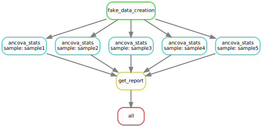

# Effective Peptide Detector

### Introduction

Analysis of covariance  (ANCOVA) is a useful tool for detecting the effectiveness of treatment with the existence of covariates, which can be measured but not controlled. However, Enabling covariation in analysis can sometimes reduce the sensitivity of the test results, because the linear fitting can introduce unexpected errors. In other words, if the candidate covariate has no effect on the testing results, then a standard t test is more appropriate. I use this demo pipeline to show how to implement this idea.

### Setup 

The pipeline is backend by [snakemake](https://snakemake.readthedocs.io/en/stable/) and a virtual environment for snakemake execution is required. Below is a quick guideline for **snakemake** VE creation.

    $ conda install -n base -c conda-forge mamba
    $ mamba create -c conda-forge -c bioconda -n snakemake snakemake
    $ conda activate snakemake

Then install other dependencies

    $ git clone https://github.com/ndu-invitae/pep-detective.git
    $ cd pep-detective
    $ pip install .

For a demo execution, please run

    $ snakemake  --jobs 4 --cores 4 --latency-wait 100

### Background - Imaginary experiment

A scientist discovered a small peptide that can potentially enhance enzyme activity, and he/she wishes to know on which enzyme, from a pool of candidates, this enhancer is effective. To verify this thought, a high-throughput experiment was conducted to determine all enzyme activities with and without the addition of this "enhancer". During the experiment, the pH level in the solutions are not perfectly stable, and some of the enzyme activities might be impacted by the pH difference, therefore the variance in repeated activity measurements might include contribution from this systematic error. From previous experience we learned that the activity of an enzyme should respond linearly to the pH changes, and the pH value can be accurately measured in the testing media. 

To test this hypothesis, we performed ANCOVA analysis for each sample using **activity** as dependent variable (dv), **pH** as covariate and **treatment** as between factor. The unadjusted p value for **pH~avtivity** correlation is used to determine if the **residuals** of dv in relation to **linear fit** or **mean** should be applied for one-tailed t test (both side were tested for identifying **enhancer** and **suppressor**).

The design of pipeline was implemented by **snakemake** as shown in the diagram below. A group of fake date was created to simulate the distribution of enzyme activities in relation to pH and treatment variables. Random errors were added to each data point to mimic noises in the activity measurement. The final results of  **pH** correlation significance from ANCOVA, as well as unadjusted p values for **enhancer** and **suppressor** from t test are summarized in the final output tsv file. Parameters such as number of fake samples and pH critical p value are defined in **config.yaml**.

